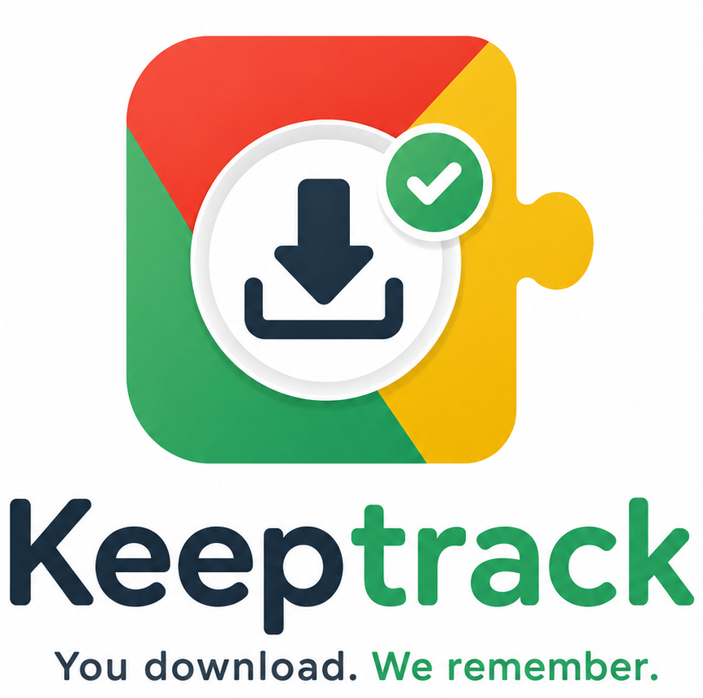
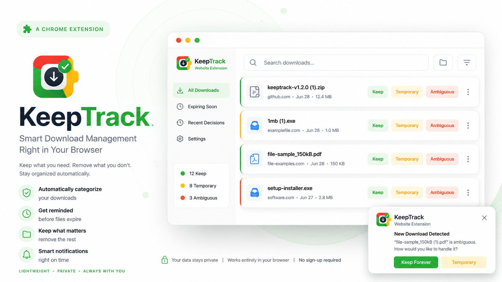

<p align="center">
  
</p>

<h1 align="center">KeepTrack</h1>
<p align="center"><em>Smart download classifier for Chrome. Captures your "keep or toss" intent at download time — so your Downloads folder stays clean forever.</em></p>

<p align="center">
  
  
  
  
  
  
  
  
</p>

<p align="center">
  
</p>

<p align="center">
  <a href="https://priyanshu-byte-coder.github.io/keeptrack/" target="_blank" rel="noopener noreferrer">
    
  </a>
</p>

Every file you download makes sense in the moment. Two weeks later, your Downloads folder is 200 files deep and you can't remember which ones matter. KeepTrack captures that decision at the exact moment you download — when you actually know the answer.

All controls in your hands — 100% free & open source, 100% local, zero telemetry.

<br>

## Features

- **Smart Classification** — Automatically classifies every download as Keep, Temporary, or Ambiguous using file type, filename keywords, and source domain.
- **Gentle Notifications** — Only interrupts for ambiguous downloads. High-confidence decisions happen silently in the background.
- **Weekly Review** — 30-second popup review of expiring temporary files. Never miss a file that matters.
- **Label Toggle** — Change any file's classification between Keep, Temporary, and Ambiguous anytime from the Settings page.
- **Delete Expired Files** — Delete individual files or bulk-delete all expired files directly from the popup with one click.
- **Clean Up Now** — Skip the weekly wait and instantly flag all temporary files for review.
- **Dry-Run Preview** — On first install, scans existing download history and shows what it *would* classify each file as. Nothing is moved, deleted, or touched until you activate.
- **All Downloads View** — Search, filter, and manage every tracked download from the Settings page.

<br>

## Demo

<video src="https://github.com/user-attachments/assets/269fbb0a-bfdd-47b4-8fb0-1fb626311cea" width="100%" controls></video>

<p align="center">
  <a href="https://youtu.be/U3X_GPUQpFk" target="_blank" rel="noopener noreferrer"><strong>▶ Video not loading? Watch on YouTube</strong></a>
</p>

<br>

## Installation — Give the repo a :star: so you don't miss future updates.

<p align="center">
  <a href="https://youtu.be/jZ_gm7946rg" target="_blank" rel="noopener noreferrer"><strong>▶ Watch the installation video</strong></a>
</p>

### Recommended: Direct Download

<a href="https://github.com/Priyanshu-byte-coder/keeptrack/releases/download/v1.2.0/keeptrack-v1.2.0.zip">
  
</a>

1. **Download** the ZIP from the button above
2. **Unzip** to any folder
3. Open `chrome://extensions` → enable **Developer Mode**
4. Click **Load unpacked** → select the unzipped folder
5. Done!

### Or Terminal (macOS / Linux)

```bash
curl -fsSL https://raw.githubusercontent.com/Priyanshu-byte-coder/keeptrack/gh-pages/install.sh | bash
```

The script automatically fetches the latest release from GitHub, downloads the ZIP, and extracts it to `~/keeptrack`.

### Or PowerShell (Windows)

```powershell
irm https://raw.githubusercontent.com/Priyanshu-byte-coder/keeptrack/gh-pages/install.ps1 | iex
```

### Or Clone from Source

```bash
git clone https://github.com/Priyanshu-byte-coder/keeptrack.git
```

Then load unpacked from `chrome://extensions`.

<br>

## How It Works

KeepTrack silently classifies every download as **keep**, **temporary**, or **ambiguous**:

| Signal | Keep | Temporary |
|--------|------|-----------|
| **File type** | `.pdf`, `.docx`, `.xlsx` | `.exe`, `.msi`, `.dmg`, `.torrent` |
| **Filename** | "invoice", "receipt", "contract", "resume" | "setup", "installer", "update", "patch" |
| **Source** | Bank sites, `.gov`, Gmail, Google Drive | Softonic, SourceForge, GitHub releases |

- **High confidence** → silent, no interruption
- **Ambiguous** → quick notification: tap "Keep" or "Temporary"

<br>

## Who Is This For?

**Students** — Lecture slides and assignment PDFs auto-kept. Random installers flagged as temporary.

**Freelancers** — Invoices, contracts, and client files from email auto-kept. Zoom installers and temp attachments flagged for cleanup.

**Developers** — GitHub release binaries and IDE installers marked temporary. Documentation exports and data backups kept.

**Anyone with a messy Downloads folder** — Stop spending 30 minutes every month guessing which files matter.

<br>

## Privacy & Security

- **Zero telemetry.** No data leaves your browser.
- **Zero network calls.** Works fully offline.
- **All data stays local.** Stored in `chrome.storage.local` on your machine.
- **Chrome Manifest V3.** Built on the latest extension platform with minimal permissions.
- **Open source.** Read every line of code.

<br>

## Contributing

See [CONTRIBUTING.md](CONTRIBUTING.md).

---

## License

MIT License. See [LICENSE](LICENSE).

---

<p align="center"><em>Made by Priyanshu</em></p>
